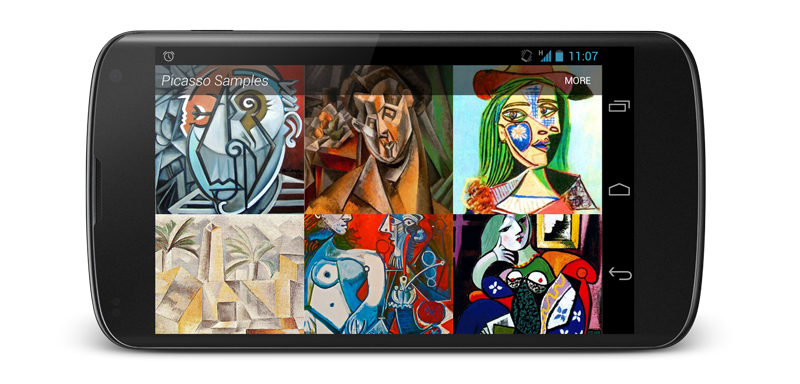

Picasso
=======

A powerful image downloading and caching library for Android



For more information please see [the website][1]


Download
--------

Download [the latest JAR][2] or grab via Gradle:
```groovy
compile 'com.squareup.picasso:picasso:2.5.2'
```
or Maven:
```xml
<dependency>
  <groupId>com.squareup.picasso</groupId>
  <artifactId>picasso</artifactId>
  <version>2.5.2</version>
</dependency>
```

Snapshots of the development version are available in [Sonatype's `snapshots` repository][snap].


ProGuard
--------

If you are using ProGuard you might need to add the following option:
```
-dontwarn com.squareup.okhttp.**
```


License
--------

    Copyright 2013 Square, Inc.

    Licensed under the Apache License, Version 2.0 (the "License");
    you may not use this file except in compliance with the License.
    You may obtain a copy of the License at

       http://www.apache.org/licenses/LICENSE-2.0

    Unless required by applicable law or agreed to in writing, software
    distributed under the License is distributed on an "AS IS" BASIS,
    WITHOUT WARRANTIES OR CONDITIONS OF ANY KIND, either express or implied.
    See the License for the specific language governing permissions and
    limitations under the License.


 [1]: http://square.github.io/picasso/
 [2]: https://search.maven.org/remote_content?g=com.squareup.picasso&a=picasso&v=LATEST
 [snap]: https://oss.sonatype.org/content/repositories/snapshots/
